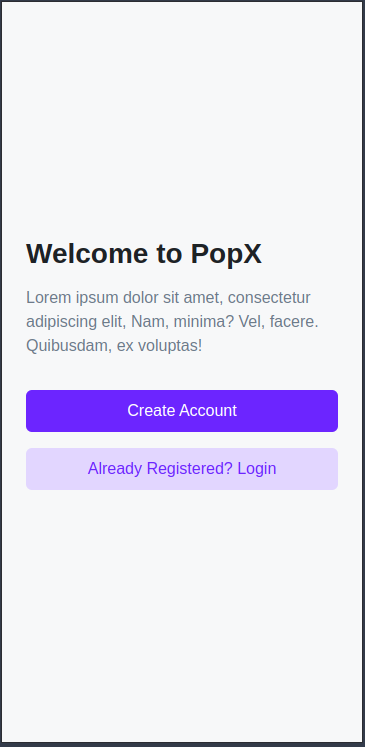
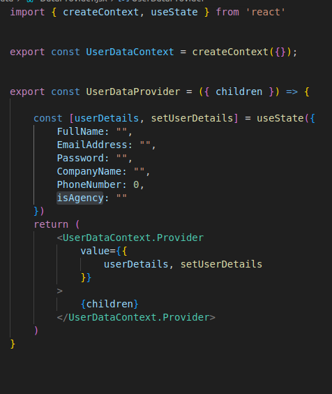
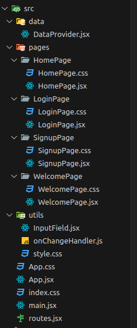

# PopX

A high-performance authentication and user management frontend with a clean, component-driven architecture built on React 19 and Vite.

# Architecture

### The application follows a modular architecture with clear separation of concerns:

- State Management

- Component Design

## State Management

        User data is managed through React Context API for efficient prop drilling prevention:
         DataProvider implementation with clean separation of concerns

## Component Design

### The application uses a component-driven development approach:

- Atomic Components - Base-level UI elements (InputField, Button)

- Molecular Components - Combinations of atomic components (Forms, Cards)

- Page Components - Full views composed of molecular components

# Features

- Bulletproof Authentication Flow - Complete signup/signin process with form validation
- Context-based State Management - Efficient global state handling with React Context API
- Component Composition Pattern - Modular, reusable component architecture
- Responsive Design - Mobile-first approach with fluid layouts
- Atomic Design Principles - Structured component hierarchy for maintainability

# Tech Stack

## Core

- React 19.0.0 - Leveraging the latest React features and optimizations
- Vite - Next-generation frontend tooling with HMR and optimized builds
- React Router DOM 7.5.3 - Client-side routing with the latest Router capabilities

## UI & Styling

- Custom CSS - Handcrafted styles for pixel-perfect implementation
